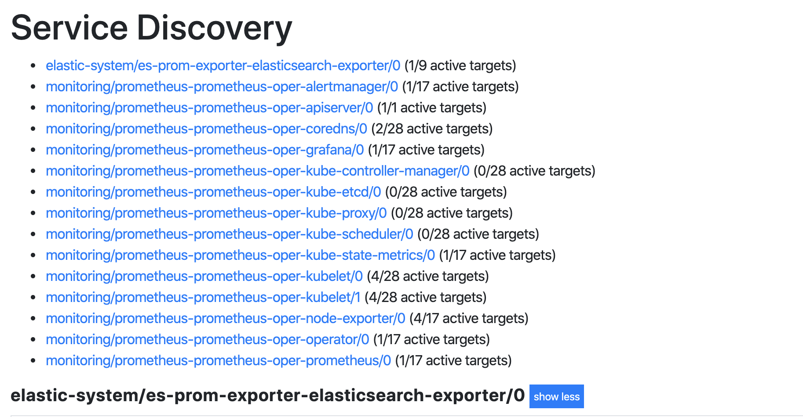
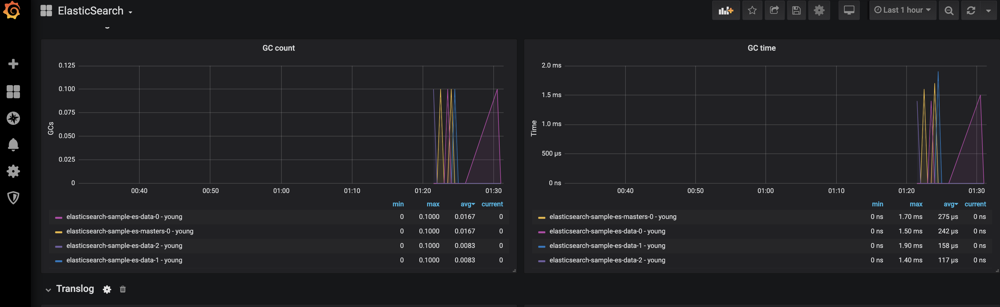

```sh
kubectl apply -f all-in-one.yaml
kubectl apply -f elasticsearch.yaml -n elastic-system
```
```
elastic-operator-0                                         1/1     Running   0          104m
elasticsearch-sample-es-data-0                             1/1     Running   0          55m
elasticsearch-sample-es-data-1                             1/1     Running   0          55m
elasticsearch-sample-es-data-2                             1/1     Running   0          55m
elasticsearch-sample-es-masters-0                          1/1     Running   0          55m

```
```sh
# make sure helm 1.16.1 is intalled
helm version --short
```

```
Client: v2.16.1+gbbdfe5e
Server: v2.16.1+gbbdfe5e
```

```bash
helm install --name prometheu stable/prometheus-operator -f prometheus-operator/values.yaml
#Collect metrics from kubelet from http
kubectl apply -f aks-kubelet-service-monitor.yaml -n monitoring

kubectl get pods -n monitoring
```
```
alertmanager-prometheus-prometheus-oper-alertmanager-0   2/2     Running   0          42m
prometheus-grafana-7ccd56f6cf-g6wzb                      2/2     Running   0          42m
prometheus-kube-state-metrics-57d6c55b56-cg6mz           1/1     Running   0          42m
prometheus-prometheus-node-exporter-46rgd                1/1     Running   0          42m
prometheus-prometheus-node-exporter-pt2m6                1/1     Running   0          42m
prometheus-prometheus-node-exporter-sxr45                1/1     Running   0          42m
prometheus-prometheus-node-exporter-xw2t5                1/1     Running   0          42m
prometheus-prometheus-oper-operator-84d5795f49-5wn28     2/2     Running   0          42m
prometheus-prometheus-prometheus-oper-prometheus-0       3/3     Running   1          21m
```

```bash
helm install es-prom-exporter stable/elasticsearch-exporter -f elasticsearc-exporter/values.yaml -n elastic-system
kubectl get pods -n elastic-system
```
```
elastic-operator-0                                         1/1     Running   0          104m
elasticsearch-sample-es-data-0                             1/1     Running   0          55m
elasticsearch-sample-es-data-1                             1/1     Running   0          55m
elasticsearch-sample-es-data-2                             1/1     Running   0          55m
elasticsearch-sample-es-masters-0                          1/1     Running   0          55m
es-prom-exporter-elasticsearch-exporter-694dd95b8b-wnb99   1/1     Running   0          32m
```
```bash
kubectl get ServiceMonitor -n elastic-system
```
```
NAME                                      AGE
es-prom-exporter-elasticsearch-exporter   34m
```

```
Connect to Prometheus for ServiceDiscovery and Targets
```


```
# Load 2322 grafana dashboard
kubectl apply -f elasticsearch-exporter/promethues-elasticsearch-dashboard.yaml -n monitoring
# wait grafana pod to load dashboard automatically
```


